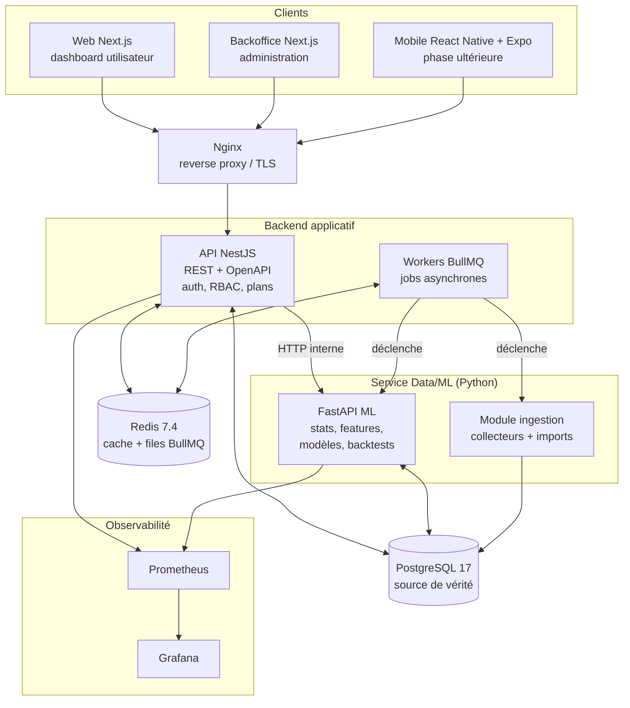

# 01 — Architecture technique

## 1. Vue d'ensemble



### Responsabilités

| Composant | Rôle | Ne fait PAS |
|---|---|---|
| **API NestJS** | Contrat REST, auth/RBAC, plans & quotas, orchestration des jobs, lecture des résultats matérialisés | de calcul statistique lourd |
| **Service ML FastAPI** | Calculs statistiques, feature engineering, entraînement/scoring des modèles, backtesting, génération de combinaisons | d'exposition publique (réseau interne uniquement) |
| **Module ingestion** (Python) | Collecteurs de sources publiques, parseurs CSV/Excel/JSON, normalisation, détection doublons/anomalies | de validation métier finale (statut définitif = pipeline qualité) |
| **Workers BullMQ** (Node) | Planification (cron), retries, orchestration des pipelines (collecte → validation → stats → prédictions) | de logique métier de calcul |
| **PostgreSQL** | Source de vérité : tirages, analyses matérialisées, prédictions, backtests, utilisateurs, audit | — |
| **Redis** | Cache des réponses statistiques, files BullMQ, rate limiting | de stockage durable |

### Principes

1. **PostgreSQL est la seule source de vérité.** Le service Python lit/écrit dans les mêmes tables (schémas dédiés `analytics`, `ml`) ; l'API Node lit les résultats matérialisés. Pas de double stockage.
2. **Calcul asynchrone, lecture synchrone.** Les analyses/modèles tournent en jobs ; l'API ne fait que servir des résultats déjà calculés (+ cache Redis). Temps de réponse constant côté client.
3. **Chaque étape du pipeline est indépendante et testable** : ingestion, validation, stats, features, modèles, backtesting sont des modules distincts avec entrées/sorties typées.
4. **Multi-jeux dès le départ** : aucune constante « 5 numéros / 1–90 » codée en dur — tout vient de la configuration du jeu en base.

## 2. Stack et versions recommandées

| Domaine | Techno | Version recommandée | Justification |
|---|---|---|---|
| Runtime backend | Node.js | **22 LTS** | LTS stable, support long |
| Framework API | NestJS | **11.x** | Structure modulaire, DI, guards/interceptors pour RBAC & quotas |
| ORM / migrations | Prisma | **6.x** | Migrations déclaratives, typage TS partagé avec le front |
| Jobs | BullMQ | **5.x** | Cron + retries + priorités sur Redis |
| Web / Admin | Next.js | **15.x** (App Router) | SSR/ISR pour le dashboard, écosystème React |
| UI | Tailwind CSS + shadcn/ui | dernières stables | Vitesse de développement, cohérence |
| Graphiques | Recharts | 2.x | Adapté aux dashboards analytiques |
| Mobile (post-MVP) | React Native + Expo | Expo SDK courant à date de la phase 11 | Build simplifié Android/iOS |
| Data/ML | Python | **3.12** | Compatibilité écosystème (pandas, scikit-learn, xgboost) |
| API ML | FastAPI | **≥ 0.115** | Async, Pydantic v2, OpenAPI natif |
| Libs data | pandas 2.x, numpy 2.x, scikit-learn 1.5+, xgboost 2.x | | Standards éprouvés |
| Base de données | PostgreSQL | **17** | Fenêtrage SQL, tableaux, JSONB, perfs |
| Cache / files | Redis | **7.4** | BullMQ, cache, rate limiting |
| Conteneurs | Docker + Docker Compose | Docker Desktop courant | Dev = prod, services isolés |
| Reverse proxy | Nginx | 1.27+ | TLS, compression, routage |
| Monitoring | Prometheus + Grafana | dernières stables | Métriques + dashboards |
| CI/CD | GitHub Actions | — | Lint, tests, build, migrations |
| Monorepo | pnpm workspaces + Turborepo | pnpm 9+, turbo 2.x | Caching de build, dépendances partagées |
| Docs API | OpenAPI / Swagger | 3.1 | Générée par NestJS et FastAPI |

> Les versions exactes (patch) seront figées dans les lockfiles en PHASE 1 ; vérifier les dernières mineures au moment de l'initialisation.

## 3. Arborescence du repository

```
lotostats/
├── apps/
│   ├── web/                      # Next.js — dashboard utilisateur (MVP)
│   ├── admin/                    # Next.js — backoffice (post-MVP, mutualise packages/ui)
│   └── mobile/                   # React Native + Expo (post-MVP)
├── services/
│   ├── api/                      # NestJS — API principale
│   │   ├── src/
│   │   │   ├── modules/
│   │   │   │   ├── auth/         # JWT, refresh, RBAC
│   │   │   │   ├── games/
│   │   │   │   ├── draws/
│   │   │   │   ├── statistics/   # lecture des stats matérialisées
│   │   │   │   ├── predictions/  # combinaisons candidates
│   │   │   │   ├── backtests/
│   │   │   │   ├── ingestion/    # pilotage imports + statut collecte
│   │   │   │   ├── users/
│   │   │   │   ├── subscriptions/
│   │   │   │   ├── notifications/
│   │   │   │   └── admin/
│   │   │   ├── jobs/             # définitions BullMQ (cron, orchestration)
│   │   │   └── common/           # guards, interceptors, filtres, config
│   │   └── prisma/               # schema.prisma + migrations
│   ├── ml/                       # FastAPI — service Data/ML (Python)
│   │   ├── app/
│   │   │   ├── api/              # routes internes (stats, features, models, backtests)
│   │   │   ├── core/             # config, accès DB, logging
│   │   │   ├── statistics/       # analyses A→K (un module par analyse)
│   │   │   ├── features/         # feature engineering
│   │   │   ├── models/           # stratégies & modèles (1 fichier = 1 stratégie)
│   │   │   ├── generation/       # moteur de combinaisons + scoring
│   │   │   ├── backtesting/      # walk-forward, métriques, baseline
│   │   │   └── analyst/          # AI Analyst (stats → explications)
│   │   └── tests/
│   └── ingestion/                # Python — collecteurs & imports
│       ├── collectors/           # collecteurs par source (1 classe = 1 source)
│       ├── importers/            # csv, excel, json
│       ├── normalizers/
│       └── quality/              # règles de validation
├── packages/
│   ├── types/                    # types TS partagés (DTO API, enums)
│   ├── ui/                       # composants React partagés web/admin
│   └── config/                   # eslint, tsconfig, prettier partagés
├── infrastructure/
│   ├── docker/                   # Dockerfiles + docker-compose.{dev,prod}.yml
│   ├── nginx/
│   └── monitoring/               # prometheus.yml, dashboards Grafana
├── docs/                         # ce dossier de conception + docs vivantes
├── scripts/                      # seed, maintenance, exports
├── .github/workflows/            # CI/CD
├── turbo.json
├── pnpm-workspace.yaml
└── README.md
```

## 4. Communication inter-services

- **API → ML** : HTTP interne (réseau Docker privé, non exposé par Nginx), authentifié par token de service. Endpoints internes du ML : `POST /internal/analysis/run`, `POST /internal/predictions/generate`, `POST /internal/backtests/run`, `GET /internal/health`.
- **Jobs** : les workers BullMQ orchestrent les pipelines périodiques :
  - `collect-draws` (cron après chaque horaire de tirage + rattrapage quotidien) → ingestion ;
  - `run-quality-checks` → pipeline qualité ;
  - `refresh-statistics` (après chaque nouveau tirage validé) → ML ;
  - `generate-candidates` (idem) ;
  - `run-backtests` (hebdomadaire + à la demande).
- **Idempotence** : chaque job porte une clé d'idempotence (ex. `collect:{game}:{draw_type}:{date}`) ; les collecteurs font de l'upsert par clé naturelle du tirage.

## 5. Environnements & déploiement

| Env | Cible | Notes |
|---|---|---|
| **dev** | Docker Compose local (Windows/WSL2) | PG + Redis + API + ML + web, hot reload |
| **staging** | VPS Docker Compose | miroir de prod, données réelles |
| **prod** | VPS (2 vCPU / 4 Go suffisent au départ) + Nginx + TLS (Let's Encrypt) | volumes PG sauvegardés (pg_dump quotidien + rétention 30 j) |

CI GitHub Actions : lint + tests (Node & Python) + build images sur chaque PR ; déploiement staging sur merge `main` ; prod par tag. Les migrations Prisma s'exécutent en étape dédiée avant le basculement.

## 6. Observabilité

- **Logs structurés JSON** partout (pino côté Node, structlog côté Python), corrélés par `request_id` / `job_id`.
- **Métriques Prometheus** : latence API par route, jobs (durée, succès/échec), fraîcheur des données (`minutes_since_last_draw_collected` — métrique d'alerte clé), statut des collecteurs, durée des backtests.
- **Alertes** : source indisponible > N heures, échec de job répété, anomalie de qualité de données, erreur 5xx en rafale.
- **Historique des jobs** en base (`ingestion_runs`, `job_runs`) consultable dans le backoffice.
