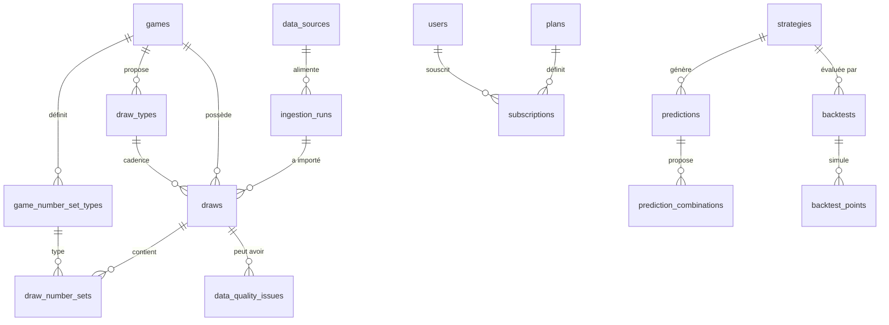

# 02 — Modèle de données & schéma PostgreSQL

## 1. Principes de conception

1. **Multi-jeux paramétrable** : les règles du jeu (plage de numéros, nombre de numéros tirés, ensembles) vivent en base, jamais dans le code. Ajouter un jeu = insérer des lignes, pas modifier le schéma.
2. **Double ensemble** : le Loto Bonheur publie des numéros **gagnants** et des numéros **machine**. Modélisé par `draw_number_sets` avec un type d'ensemble — extensible à des jeux avec bonus.
3. **Numéros en tableau SQL** : les 5 numéros d'un ensemble sont stockés en `smallint[]` trié + contraintes. Les analyses utilisent `unnest()` — simple, performant à cette volumétrie (~2 500 tirages/an/type de tirage), et l'intégrité est garantie par contraintes. Une vue normalisée `v_draw_numbers` est fournie pour les requêtes analytiques.
4. **Traçabilité totale** : chaque tirage porte sa source, sa date de collecte, son run d'ingestion et son statut de validation.
5. **Anti-fuite temporelle** : chaque prédiction et chaque point de backtest enregistrent le **dernier tirage connu** au moment du calcul (`dataset_cutoff_draw_id`) — vérifiable a posteriori.
6. **Schémas PostgreSQL** : `core` (référentiel + tirages), `analytics` (résultats matérialisés), `ml` (modèles, prédictions, backtests), `app` (utilisateurs, abonnements, notifications), `ops` (ingestion, jobs, audit). Migrations gérées par **Prisma Migrate** (le service Python lit/écrit via SQLAlchemy sur les mêmes tables ; Prisma est l'unique propriétaire des migrations).

## 2. Diagramme entités-relations (cœur)



## 3. Schéma détaillé

### Schéma `core` — référentiel & tirages

```sql
CREATE TABLE core.games (
    id              uuid PRIMARY KEY DEFAULT gen_random_uuid(),
    code            text NOT NULL UNIQUE,          -- 'loto-bonheur'
    name            text NOT NULL,                 -- 'Loto Bonheur'
    operator        text NOT NULL,                 -- 'LONACI'
    country_code    char(2) NOT NULL DEFAULT 'CI',
    is_active       boolean NOT NULL DEFAULT true,
    metadata        jsonb NOT NULL DEFAULT '{}',
    created_at      timestamptz NOT NULL DEFAULT now(),
    updated_at      timestamptz NOT NULL DEFAULT now()
);
-- Justification : racine du multi-jeux. Aucune règle de tirage ici : elles sont
-- portées par game_number_set_types (un jeu peut avoir plusieurs ensembles).

CREATE TABLE core.game_number_set_types (
    id              uuid PRIMARY KEY DEFAULT gen_random_uuid(),
    game_id         uuid NOT NULL REFERENCES core.games(id),
    code            text NOT NULL,                 -- 'WINNING' | 'MACHINE' | 'BONUS'...
    label           text NOT NULL,                 -- 'Numéros gagnants'
    numbers_count   smallint NOT NULL CHECK (numbers_count > 0),   -- 5
    number_min      smallint NOT NULL,             -- 1
    number_max      smallint NOT NULL,             -- 90
    display_order   smallint NOT NULL DEFAULT 0,
    UNIQUE (game_id, code),
    CHECK (number_max > number_min)
);
-- Justification : règles du jeu paramétrables. Loto Bonheur = 2 lignes
-- (WINNING 5/1-90, MACHINE 5/1-90). Toutes les analyses lisent ces bornes.

CREATE TABLE core.draw_types (
    id              uuid PRIMARY KEY DEFAULT gen_random_uuid(),
    game_id         uuid NOT NULL REFERENCES core.games(id),
    code            text NOT NULL,                 -- 'reveil', 'etoile', 'akwaba'...
    name            text NOT NULL,
    scheduled_time  time,                          -- horaire habituel si connu
    days_of_week    smallint[],                    -- NULL = tous les jours
    is_active       boolean NOT NULL DEFAULT true,
    UNIQUE (game_id, code)
);
-- Justification : le Loto Bonheur a plusieurs tirages nommés par jour.
-- La liste exacte sera confirmée à la mise en place de la collecte (seed).

CREATE TYPE core.validation_status AS ENUM ('PENDING_REVIEW', 'VALID', 'INVALID');

CREATE TABLE core.draws (
    id                  uuid PRIMARY KEY DEFAULT gen_random_uuid(),
    game_id             uuid NOT NULL REFERENCES core.games(id),
    draw_type_id        uuid NOT NULL REFERENCES core.draw_types(id),
    draw_date           date NOT NULL,
    draw_time           time,                      -- si publié
    external_ref        text,                      -- n° de tirage officiel si publié
    status              core.validation_status NOT NULL DEFAULT 'PENDING_REVIEW',
    source_id           uuid NOT NULL REFERENCES ops.data_sources(id),
    ingestion_run_id    uuid REFERENCES ops.ingestion_runs(id),
    collected_at        timestamptz NOT NULL,
    validated_at        timestamptz,
    validated_by        uuid REFERENCES app.users(id),   -- si validation manuelle
    metadata            jsonb NOT NULL DEFAULT '{}',     -- payload brut source
    created_at          timestamptz NOT NULL DEFAULT now(),
    updated_at          timestamptz NOT NULL DEFAULT now(),
    UNIQUE (game_id, draw_type_id, draw_date)      -- clé naturelle anti-doublon
);
CREATE INDEX idx_draws_game_date   ON core.draws (game_id, draw_date DESC);
CREATE INDEX idx_draws_status      ON core.draws (status) WHERE status <> 'VALID';
-- Justification : la contrainte UNIQUE est LA défense anti-doublon (upsert des
-- collecteurs). L'index partiel sert la file de revue du backoffice.

CREATE TABLE core.draw_number_sets (
    id              uuid PRIMARY KEY DEFAULT gen_random_uuid(),
    draw_id         uuid NOT NULL REFERENCES core.draws(id) ON DELETE CASCADE,
    set_type_id     uuid NOT NULL REFERENCES core.game_number_set_types(id),
    numbers         smallint[] NOT NULL,           -- trié croissant, ex {4,17,33,58,89}
    UNIQUE (draw_id, set_type_id)
);
CREATE INDEX idx_dns_numbers ON core.draw_number_sets USING gin (numbers);
-- Contrainte d'intégrité (trigger, car CHECK ne peut pas lire une autre table) :
--  * cardinalité = numbers_count du set_type ;
--  * bornes number_min..number_max ;
--  * pas de doublon dans le tableau ; tableau trié à l'insertion.
-- Justification : à ~9 000 tirages/an (multi-tirages/jour), le tableau + GIN
-- couvre les requêtes « tirages contenant le numéro N » et unnest() alimente
-- toutes les agrégations. Volume trop faible pour justifier une table de faits.

CREATE VIEW core.v_draw_numbers AS
SELECT d.id AS draw_id, d.game_id, d.draw_type_id, d.draw_date, d.status,
       s.set_type_id, t.code AS set_code, n.number, n.ordinality AS position
FROM core.draws d
JOIN core.draw_number_sets s ON s.draw_id = d.id
JOIN core.game_number_set_types t ON t.id = s.set_type_id
CROSS JOIN LATERAL unnest(s.numbers) WITH ORDINALITY AS n(number, ordinality);
-- Justification : forme normalisée « 1 ligne = 1 numéro » pour le SQL analytique.
```

### Schéma `ops` — sources, ingestion, qualité, jobs, audit

```sql
CREATE TYPE ops.source_kind AS ENUM ('SCRAPER', 'CSV', 'EXCEL', 'JSON', 'MANUAL', 'API');

CREATE TABLE ops.data_sources (
    id              uuid PRIMARY KEY DEFAULT gen_random_uuid(),
    code            text NOT NULL UNIQUE,          -- 'lonaci-site', 'manual-admin'...
    kind            ops.source_kind NOT NULL,
    label           text NOT NULL,
    base_url        text,
    config          jsonb NOT NULL DEFAULT '{}',   -- sélecteurs, mapping colonnes...
    is_active       boolean NOT NULL DEFAULT true,
    priority        smallint NOT NULL DEFAULT 100, -- ordre de confiance si conflit
    created_at      timestamptz NOT NULL DEFAULT now()
);

CREATE TYPE ops.run_status AS ENUM ('RUNNING', 'SUCCESS', 'PARTIAL', 'FAILED');

CREATE TABLE ops.ingestion_runs (
    id              uuid PRIMARY KEY DEFAULT gen_random_uuid(),
    source_id       uuid NOT NULL REFERENCES ops.data_sources(id),
    triggered_by    text NOT NULL,                 -- 'cron' | 'manual' | 'backfill'
    started_at      timestamptz NOT NULL DEFAULT now(),
    finished_at     timestamptz,
    status          ops.run_status NOT NULL DEFAULT 'RUNNING',
    stats           jsonb NOT NULL DEFAULT '{}',   -- {found, inserted, duplicates, invalid}
    error           text,
    file_name       text                            -- pour les imports fichiers
);
CREATE INDEX idx_ing_runs_source ON ops.ingestion_runs (source_id, started_at DESC);

CREATE TABLE ops.ingestion_events (
    id              bigserial PRIMARY KEY,
    run_id          uuid NOT NULL REFERENCES ops.ingestion_runs(id) ON DELETE CASCADE,
    level           text NOT NULL,                 -- INFO | WARN | ERROR
    message         text NOT NULL,
    context         jsonb NOT NULL DEFAULT '{}',
    created_at      timestamptz NOT NULL DEFAULT now()
);
-- Justification : journalisation détaillée de chaque import, consultable au backoffice.

CREATE TABLE ops.data_quality_issues (
    id              uuid PRIMARY KEY DEFAULT gen_random_uuid(),
    draw_id         uuid REFERENCES core.draws(id) ON DELETE CASCADE,
    run_id          uuid REFERENCES ops.ingestion_runs(id),
    rule_code       text NOT NULL,     -- 'DUPLICATE','OUT_OF_RANGE','MISSING_SET',
                                       -- 'INVALID_DATE','SOURCE_CONFLICT','FORMAT_CHANGE'
    severity        text NOT NULL,     -- 'BLOCKING' (=> INVALID) | 'WARNING' (=> PENDING_REVIEW)
    details         jsonb NOT NULL DEFAULT '{}',
    resolved_at     timestamptz,
    resolved_by     uuid REFERENCES app.users(id),
    created_at      timestamptz NOT NULL DEFAULT now()
);

CREATE TABLE ops.job_runs (                        -- historique des jobs BullMQ
    id              uuid PRIMARY KEY DEFAULT gen_random_uuid(),
    queue           text NOT NULL,
    job_name        text NOT NULL,
    job_key         text,                          -- clé d'idempotence
    status          ops.run_status NOT NULL,
    started_at      timestamptz NOT NULL,
    finished_at     timestamptz,
    duration_ms     integer,
    error           text
);

CREATE TABLE ops.audit_logs (
    id              bigserial PRIMARY KEY,
    user_id         uuid REFERENCES app.users(id),
    action          text NOT NULL,                 -- 'draw.correct', 'user.ban'...
    entity_type     text NOT NULL,
    entity_id       text NOT NULL,
    before          jsonb,
    after           jsonb,
    ip              inet,
    created_at      timestamptz NOT NULL DEFAULT now()
);
```

### Schéma `analytics` — résultats matérialisés

Recalculés par le service ML après chaque tirage validé ; l'API ne fait que lire (+ cache Redis).

```sql
CREATE TABLE analytics.analysis_windows (          -- fenêtres pré-définies
    code            text PRIMARY KEY               -- 'ALL','LAST_100','LAST_50',
);                                                 -- 'LAST_20','LAST_10','YEAR_2025'...

CREATE TABLE analytics.number_stats (
    game_id         uuid NOT NULL REFERENCES core.games(id),
    set_type_id     uuid NOT NULL REFERENCES core.game_number_set_types(id),
    draw_type_id    uuid,                          -- NULL = tous tirages confondus
    window_code     text NOT NULL REFERENCES analytics.analysis_windows(code),
    number          smallint NOT NULL,
    frequency       integer NOT NULL,              -- nb d'apparitions
    relative_freq   numeric(8,6) NOT NULL,         -- fréquence relative
    current_gap     integer NOT NULL,              -- retard actuel (nb tirages)
    avg_gap         numeric(8,2),
    max_gap         integer,
    last_seen_date  date,
    trend           numeric(8,4),                  -- pente de fréquence récente
    computed_at     timestamptz NOT NULL,
    as_of_draw_id   uuid NOT NULL REFERENCES core.draws(id),  -- traçabilité
    PRIMARY KEY (game_id, set_type_id, COALESCE_KEY, window_code, number)
);
-- NB: en pratique Prisma modélisera draw_type_id avec une valeur sentinelle ou
-- deux tables ; le choix final se fait en PHASE 4. Index sur (game_id, window_code).

CREATE TABLE analytics.pair_stats (
    game_id         uuid NOT NULL,
    set_type_id     uuid NOT NULL,
    window_code     text NOT NULL,
    number_a        smallint NOT NULL,             -- a < b
    number_b        smallint NOT NULL,
    frequency       integer NOT NULL,
    lift            numeric(8,4),                  -- fréq observée / fréq attendue
    computed_at     timestamptz NOT NULL,
    PRIMARY KEY (game_id, set_type_id, window_code, number_a, number_b)
);
-- Triplets : calculés à la volée sur demande (top-N seulement) — la matérialisation
-- complète (90³) serait inutilement volumineuse.

CREATE TABLE analytics.draw_shape_stats (          -- distributions par tirage
    game_id         uuid NOT NULL,
    set_type_id     uuid NOT NULL,
    window_code     text NOT NULL,
    metric          text NOT NULL,   -- 'sum','spread','odd_count','high_count',
                                     -- 'consecutive_count','repeat_prev_count'
    histogram       jsonb NOT NULL,  -- {"valeur": effectif, ...}
    summary         jsonb NOT NULL,  -- {mean, median, min, max, std}
    computed_at     timestamptz NOT NULL,
    PRIMARY KEY (game_id, set_type_id, window_code, metric)
);
```

### Schéma `ml` — stratégies, modèles, prédictions, backtests

```sql
CREATE TABLE ml.strategies (
    id              uuid PRIMARY KEY DEFAULT gen_random_uuid(),
    code            text NOT NULL UNIQUE,          -- 'STRATEGY_RANDOM', 'STRATEGY_FREQUENCY'...
    name            text NOT NULL,
    description     text NOT NULL,
    default_config  jsonb NOT NULL DEFAULT '{}',   -- coefficients de score, fenêtres...
    is_enabled      boolean NOT NULL DEFAULT true,
    min_plan        text NOT NULL DEFAULT 'FREE',  -- gating SaaS
    created_at      timestamptz NOT NULL DEFAULT now()
);

CREATE TABLE ml.models (                           -- artefacts ML entraînés
    id              uuid PRIMARY KEY DEFAULT gen_random_uuid(),
    strategy_id     uuid REFERENCES ml.strategies(id),
    name            text NOT NULL,
    version         text NOT NULL,
    algo            text NOT NULL,                 -- 'random_forest','xgboost'...
    params          jsonb NOT NULL,
    trained_on_draws int,                          -- taille du train set
    train_cutoff_draw_id uuid REFERENCES core.draws(id),  -- anti-leakage
    artifact_path   text,                          -- chemin du .joblib
    metrics         jsonb,                         -- métriques de validation
    status          text NOT NULL DEFAULT 'ACTIVE',
    created_at      timestamptz NOT NULL DEFAULT now(),
    UNIQUE (name, version)
);

CREATE TABLE ml.predictions (                      -- 1 génération = 1 lot de candidates
    id                    uuid PRIMARY KEY DEFAULT gen_random_uuid(),
    game_id               uuid NOT NULL REFERENCES core.games(id),
    draw_type_id          uuid REFERENCES core.draw_types(id),
    target_draw_date      date NOT NULL,
    strategy_id           uuid NOT NULL REFERENCES ml.strategies(id),
    model_id              uuid REFERENCES ml.models(id),
    config_used           jsonb NOT NULL,
    dataset_cutoff_draw_id uuid NOT NULL REFERENCES core.draws(id), -- dernier tirage connu
    generated_at          timestamptz NOT NULL DEFAULT now(),
    UNIQUE (game_id, draw_type_id, target_draw_date, strategy_id)
);
CREATE INDEX idx_pred_target ON ml.predictions (game_id, target_draw_date DESC);

CREATE TABLE ml.prediction_combinations (
    id              uuid PRIMARY KEY DEFAULT gen_random_uuid(),
    prediction_id   uuid NOT NULL REFERENCES ml.predictions(id) ON DELETE CASCADE,
    rank            smallint NOT NULL,
    numbers         smallint[] NOT NULL,
    score           numeric(10,4) NOT NULL,
    score_breakdown jsonb NOT NULL,   -- {frequency: x, recency: y, cooccurrence: z, ...}
    explanation     text NOT NULL,    -- texte généré par l'AI Analyst
    UNIQUE (prediction_id, rank)
);
-- Justification : score_breakdown rend chaque combinaison auditable et explicable.

CREATE TABLE ml.backtests (
    id              uuid PRIMARY KEY DEFAULT gen_random_uuid(),
    game_id         uuid NOT NULL REFERENCES core.games(id),
    draw_type_id    uuid,
    strategy_id     uuid NOT NULL REFERENCES ml.strategies(id),
    model_id        uuid REFERENCES ml.models(id),
    config          jsonb NOT NULL,
    from_draw_date  date NOT NULL,
    to_draw_date    date NOT NULL,
    status          ops.run_status NOT NULL DEFAULT 'RUNNING',
    metrics         jsonb,            -- {avg_matches, match_distribution: {0:..,1:..},
                                      --  vs_random: {avg_matches, p_value}, by_period: [...]}
    started_at      timestamptz NOT NULL DEFAULT now(),
    finished_at     timestamptz
);

CREATE TABLE ml.backtest_points (                  -- détail pas-à-pas (walk-forward)
    id              bigserial PRIMARY KEY,
    backtest_id     uuid NOT NULL REFERENCES ml.backtests(id) ON DELETE CASCADE,
    target_draw_id  uuid NOT NULL REFERENCES core.draws(id),
    cutoff_draw_id  uuid NOT NULL REFERENCES core.draws(id), -- < target (contrôlé)
    predicted       smallint[] NOT NULL,
    actual          smallint[] NOT NULL,
    matches         smallint NOT NULL
);
CREATE INDEX idx_btp_backtest ON ml.backtest_points (backtest_id);
-- Justification : le détail permet la distribution des correspondances et
-- l'audit anti-leakage (cutoff_draw_id doit toujours précéder target_draw_id).
```

### Schéma `app` — utilisateurs, SaaS, notifications

```sql
CREATE TYPE app.user_role AS ENUM ('USER', 'ADMIN', 'SUPERADMIN');

CREATE TABLE app.users (
    id              uuid PRIMARY KEY DEFAULT gen_random_uuid(),
    email           citext NOT NULL UNIQUE,
    password_hash   text NOT NULL,                 -- argon2id
    display_name    text,
    role            app.user_role NOT NULL DEFAULT 'USER',
    is_active       boolean NOT NULL DEFAULT true,
    email_verified_at timestamptz,
    created_at      timestamptz NOT NULL DEFAULT now(),
    updated_at      timestamptz NOT NULL DEFAULT now()
);

CREATE TABLE app.refresh_tokens (
    id              uuid PRIMARY KEY DEFAULT gen_random_uuid(),
    user_id         uuid NOT NULL REFERENCES app.users(id) ON DELETE CASCADE,
    token_hash      text NOT NULL,                 -- jamais le token en clair
    expires_at      timestamptz NOT NULL,
    revoked_at      timestamptz,
    user_agent      text,
    ip              inet,
    created_at      timestamptz NOT NULL DEFAULT now()
);
CREATE INDEX idx_rt_user ON app.refresh_tokens (user_id) WHERE revoked_at IS NULL;

CREATE TABLE app.plans (
    code            text PRIMARY KEY,              -- 'FREE' | 'PREMIUM' | 'PRO'
    name            text NOT NULL,
    price_monthly_xof integer NOT NULL DEFAULT 0,
    entitlements    jsonb NOT NULL
    -- ex: {history_days: 30, strategies: ["FREQUENCY"], backtesting: false,
    --      api_access: false, exports: false, ai_analyst: false,
    --      rate_limit_per_min: 30}
);
-- Justification : les droits sont des DONNÉES (entitlements JSONB), pas du code.
-- Modifier un plan = update d'une ligne. L'API lit les entitlements via un guard.

CREATE TABLE app.subscriptions (
    id              uuid PRIMARY KEY DEFAULT gen_random_uuid(),
    user_id         uuid NOT NULL REFERENCES app.users(id),
    plan_code       text NOT NULL REFERENCES app.plans(code),
    status          text NOT NULL,                 -- 'ACTIVE','CANCELLED','EXPIRED','TRIAL'
    started_at      timestamptz NOT NULL,
    expires_at      timestamptz,
    payment_ref     text,                          -- réf. agrégateur (CinetPay/Stripe...)
    created_at      timestamptz NOT NULL DEFAULT now()
);
CREATE INDEX idx_sub_user ON app.subscriptions (user_id, status);

CREATE TABLE app.api_keys (                        -- plan PRO
    id              uuid PRIMARY KEY DEFAULT gen_random_uuid(),
    user_id         uuid NOT NULL REFERENCES app.users(id) ON DELETE CASCADE,
    key_hash        text NOT NULL UNIQUE,
    label           text,
    last_used_at    timestamptz,
    revoked_at      timestamptz,
    created_at      timestamptz NOT NULL DEFAULT now()
);

CREATE TABLE app.notifications (
    id              uuid PRIMARY KEY DEFAULT gen_random_uuid(),
    user_id         uuid REFERENCES app.users(id) ON DELETE CASCADE, -- NULL = broadcast
    type            text NOT NULL,   -- 'NEW_DRAW','NEW_ANALYSIS','NEW_CANDIDATES',
                                     -- 'ANOMALY','SOURCE_DOWN','MODEL_REFRESHED'
    title           text NOT NULL,
    body            text NOT NULL,
    payload         jsonb NOT NULL DEFAULT '{}',
    read_at         timestamptz,
    created_at      timestamptz NOT NULL DEFAULT now()
);
CREATE INDEX idx_notif_user ON app.notifications (user_id, created_at DESC);

CREATE TABLE app.push_tokens (                     -- phase mobile
    id              uuid PRIMARY KEY DEFAULT gen_random_uuid(),
    user_id         uuid NOT NULL REFERENCES app.users(id) ON DELETE CASCADE,
    token           text NOT NULL UNIQUE,          -- Expo push token
    platform        text NOT NULL,                 -- 'ios' | 'android'
    created_at      timestamptz NOT NULL DEFAULT now()
);
```

## 4. Volumétrie & performance

- Ordre de grandeur : ~7 tirages/jour × 365 j ≈ **2 500–9 000 tirages/an** selon le nombre de types de tirages — volumétrie faible. PostgreSQL tiendra des années sans partitionnement.
- Les coûts sont dans les **agrégations analytiques**, d'où la matérialisation dans `analytics.*` (recalcul en job, jamais à la requête) + cache Redis avec TTL invalidé à chaque nouveau tirage validé.
- Sauvegardes : `pg_dump` quotidien, rétention 30 jours, test de restauration mensuel.

## 5. Migrations

- **Prisma Migrate** est l'unique gestionnaire de schéma (`services/api/prisma/`). Chaque migration est revue en PR et appliquée par la CI avant déploiement.
- Le service Python n'exécute **jamais** de DDL ; il consomme le schéma via SQLAlchemy (réflexion ou modèles maintenus en miroir, vérifiés par un test de conformité de schéma en CI).
- Seed initial : jeu `loto-bonheur`, ses 2 `game_number_set_types`, la liste des `draw_types` (à confirmer avec la source), les `plans` FREE/PREMIUM/PRO, les `strategies`, les `analysis_windows`.
