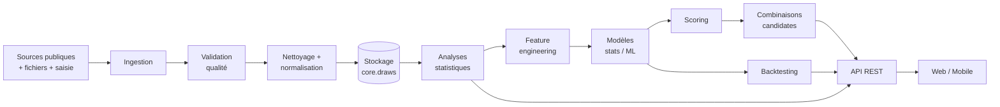

# 03 — Pipeline Data, statistiques, ML & backtesting

## 1. Pipeline global



Chaque étape est un module indépendant avec entrées/sorties typées et tests dédiés. Orchestration par jobs BullMQ (cf. [01-architecture.md](01-architecture.md) §4).

## 2. Ingestion

### Sources (par ordre de mise en œuvre)

1. **Saisie manuelle admin** (dès la PHASE 2) — formulaire backoffice ; permet de démarrer sans dépendre d'aucune source externe.
2. **Imports fichiers** : CSV, Excel (openpyxl), JSON — mapping de colonnes configurable par source (`data_sources.config`), prévisualisation et rapport d'import (lignes lues / insérées / doublons / rejetées).
3. **Collecteur web** : récupération des résultats publiés sur des pages publiques (site LONACI et/ou agrégateurs de résultats). Contraintes strictes :
   - respect du robots.txt et des CGU de chaque source ; **aucun contournement** de protection, captcha ou authentification ;
   - fréquence de collecte raisonnable (quelques requêtes/jour, User-Agent identifiable) ;
   - un collecteur = une classe versionnée avec parseur dédié ; la **détection de changement de structure** (parsing qui échoue ou champs manquants) déclenche une alerte `FORMAT_CHANGE` et bascule le run en `PARTIAL`/`FAILED` sans corrompre la base ;
   - la source exacte (URL, horodatage, payload brut dans `draws.metadata`) est conservée pour audit.
4. **API externe** (futur) : connecteur générique si une API officielle devient disponible.

### Règles communes à tous les connecteurs

- **Upsert par clé naturelle** `(game, draw_type, draw_date)` → les doublons sont détectés structurellement ; une re-collecte du même tirage avec les mêmes numéros est un no-op journalisé, avec des numéros **différents** c'est un conflit `SOURCE_CONFLICT` → `PENDING_REVIEW`.
- Chaque exécution crée un `ingestion_runs` + événements détaillés (`ingestion_events`).
- Le système fonctionne en mode dégradé : si la source automatique est indisponible, alerte + possibilité d'import fichier ou saisie manuelle. Rien ne bloque le reste de la plateforme.

## 3. Validation & qualité (Data Quality)

Règles exécutées à l'ingestion puis re-jouables à la demande :

| Règle | Code | Sévérité | Effet |
|---|---|---|---|
| Doublon de clé naturelle avec numéros différents | `SOURCE_CONFLICT` | WARNING | `PENDING_REVIEW` |
| Numéro hors plage du jeu | `OUT_OF_RANGE` | BLOCKING | `INVALID` |
| Cardinalité incorrecte (≠ 5 numéros) | `BAD_CARDINALITY` | BLOCKING | `INVALID` |
| Numéro dupliqué dans un ensemble | `DUP_IN_SET` | BLOCKING | `INVALID` |
| Ensemble manquant (gagnants sans machine, etc.) | `MISSING_SET` | WARNING | `PENDING_REVIEW` |
| Date invalide / future | `INVALID_DATE` | BLOCKING | `INVALID` |
| Tirage à une date sans tirage programmé | `UNSCHEDULED` | WARNING | `PENDING_REVIEW` |
| Changement de format source | `FORMAT_CHANGE` | WARNING | alerte ops |

- Seuls les tirages `VALID` alimentent les statistiques et les modèles.
- File de revue dans le backoffice : l'admin valide, corrige (avec `audit_logs`) ou invalide.
- Normalisation : tri croissant des numéros, dates ISO, fuseaux (`Africa/Abidjan`), codes de tirage canoniques.

## 4. Analyses statistiques (A → K du cahier des charges)

Toutes calculées **par jeu, par ensemble (gagnants / machine), par type de tirage ou tous confondus**, et **par fenêtre** (`ALL`, `LAST_100`, `LAST_50`, `LAST_20`, `LAST_10`, période personnalisée, année, mois). Les bornes et cardinalités viennent de la config du jeu — rien n'est codé en dur.

| # | Analyse | Sorties | Matérialisation |
|---|---|---|---|
| A | Fréquences | fréquence absolue/relative par numéro, par période, évolution | `analytics.number_stats` |
| B | Chaud / froid | classement par fréquence sur fenêtres courtes vs longues, comparaison court/moyen/long terme | dérivé de A (vue API) |
| C | Retard | retard actuel, retard moyen, retard max, distribution des retards | `number_stats` + histogrammes |
| D | Paires / triplets | paires fréquentes avec **lift** (observé/attendu), triplets top-N à la volée, cooccurrences | `analytics.pair_stats` |
| E | Consécutifs | nb de consécutifs par tirage, fréquence des configurations | `draw_shape_stats` |
| F | Pair / impair | distribution des ratios (0/5 → 5/5), adaptée aux règles réelles du jeu | `draw_shape_stats` |
| G | Haut / bas | idem avec seuil = milieu de l'intervalle réel (1–45 / 46–90) | `draw_shape_stats` |
| H | Somme | somme, moyenne, médiane, min, max, distribution historique | `draw_shape_stats` |
| I | Dispersion | étendue min-max, écart-type, répartition sur l'intervalle | `draw_shape_stats` |
| J | Répétitions | nb de numéros répétés entre deux tirages successifs, distribution | `draw_shape_stats` |
| K | Fenêtres | toutes les analyses ci-dessus paramétrées par fenêtre | dimension `window_code` |

Garde-fou UI : les écrans « chaud/froid » et « retard » portent un encart permanent rappelant que ces observations sont descriptives et **n'impliquent aucune probabilité accrue** (sophisme du joueur).

## 5. Feature engineering

Module `services/ml/app/features/`, sortie = DataFrames reproductibles (seed + cutoff explicites).

**Par numéro** (1–90, à une date de coupure donnée) : fréquence globale, fréquence récente (fenêtres 10/20/50/100), fréquence pondérée par récence (décroissance exponentielle, λ configurable), retard actuel, retard moyen, ratio retard actuel/retard moyen, score de cooccurrence avec les numéros récemment sortis, tendance (pente de fréquence), stabilité (variance de fréquence inter-fenêtres), volatilité.

**Par tirage** (features descriptives et cibles de contraintes) : somme, moyenne, variance, étendue, ratio pair/impair, ratio haut/bas, nb de consécutifs, nb de répétitions avec le tirage précédent, distribution des écarts entre numéros triés.

**Règle d'or anti-leakage** : toute fonction de features prend un paramètre `cutoff_draw_id` obligatoire et ne lit **que** les tirages strictement antérieurs. Testé unitairement (un test injecte un tirage « futur » et vérifie qu'il n'influence aucune feature).

## 6. Stratégies & modèles

Progression du simple vers le complexe — un modèle complexe n'est retenu que s'il apporte un gain mesuré au backtest (ce qui, sur un tirage équitable, n'est pas attendu — et sera affiché honnêtement).

| Stratégie | Base | Type |
|---|---|---|
| `STRATEGY_RANDOM` | tirage uniforme — **baseline obligatoire** | référence |
| `STRATEGY_FREQUENCY` | fréquence historique | interprétable |
| `STRATEGY_HOT_NUMBERS` | fréquence sur fenêtre courte | interprétable |
| `STRATEGY_COLD_NUMBERS` | numéros les moins fréquents (documenté comme non prédictif) | interprétable |
| `STRATEGY_RECENCY` | fréquence pondérée par récence | interprétable |
| `STRATEGY_BALANCED` | contraintes de forme (pair/impair, haut/bas, somme dans la plage historique centrale) | interprétable |
| `STRATEGY_COOCCURRENCE` | score de paires/lift | interprétable |
| `STRATEGY_STATISTICAL` | score composite fréquence + retard + cooccurrence | interprétable |
| `STRATEGY_MONTE_CARLO` | simulation massive + filtrage par contraintes | probabiliste |
| `STRATEGY_ML_RF` / `STRATEGY_ML_GB` / `STRATEGY_ML_XGB` | classif. « le numéro N sort dans le prochain tirage » sur les features §5 ; XGBoost seulement si gain vs GB | ML expérimental |
| `STRATEGY_ENSEMBLE` | agrégation pondérée des scores des stratégies actives | méta |

- Chaque stratégie = une classe avec interface commune `generate(game, draw_type, cutoff, config) -> [combinations + scores + breakdown]`, testable isolément.
- Modèles temporels (type ARIMA/LSTM) : **non retenus au départ** — ils supposent une structure temporelle dont l'existence doit d'abord être démontrée par les tests statistiques (cf. [08-risques-limites.md](08-risques-limites.md)) ; réévalués si les données le justifient.
- Entraînement versionné dans `ml.models` (params, cutoff du train, métriques, artefact joblib).

## 7. Génération de combinaisons candidates

Moteur `services/ml/app/generation/` :

1. **Génération** d'un grand pool de candidates (échantillonnage guidé par les scores par numéro + Monte Carlo), taille configurable (ex. 50 000).
2. **Scoring** de chaque candidate :
   ```
   CombinationScore = w1·fréquence + w2·récence + w3·cooccurrence
                    + w4·équilibre_pair_impair + w5·équilibre_haut_bas
                    + w6·dispersion + w7·diversité
                    - pénalités (formes historiquement rarissimes, ex. 5 consécutifs)
   ```
   Coefficients `w*` configurables par stratégie (`strategies.default_config`), modifiables au backoffice.
3. **Contraintes statistiques** (optionnelles, configurables) : somme dans l'intervalle inter-quantiles historique, max de consécutifs, etc.
4. **Dé-duplication / diversité** : élimination des candidates trop similaires (distance de Jaccard minimale entre les candidates retenues).
5. **Sélection** du top-N (ex. 10) + **explication par candidate** : décomposition chiffrée du score (`score_breakdown`) + phrase générée par l'AI Analyst.

Le score est affiché comme « score statistique relatif au pool de candidates » — jamais comme une probabilité de gain.

## 8. Backtesting (walk-forward)

Module `services/ml/app/backtesting/` — fonctionnalité obligatoire :

```
pour t de N0 à T-1 :
    entraîner/paramétrer sur les tirages [1 .. t]      (cutoff = t)
    générer les candidates pour le tirage t+1
    comparer aux numéros réellement sortis en t+1
    enregistrer backtest_points(cutoff=t, target=t+1, matches)
```

- **Métriques** : nb moyen de correspondances, distribution (0 à 5 matches), performance par stratégie, par période (année/mois), par type de tirage ; le tout **versus la baseline aléatoire** exécutée sur les mêmes cibles (avec intervalle de confiance — la référence théorique pour 5/90 est E[matches] = 5×5/90 ≈ 0,278).
- **Comparaison statistique** : test de différence de moyennes stratégie vs random (p-value affichée, avec pédagogie sur les comparaisons multiples).
- **Anti-leakage vérifié structurellement** : contrainte applicative + test d'intégrité `cutoff_draw < target_draw` sur chaque point ; les features re-calculées au cutoff (jamais de stats matérialisées « actuelles » réutilisées dans le passé).
- Résultats persistés (`ml.backtests`, `ml.backtest_points`) et affichés dans le dashboard (tableau comparatif des stratégies + graphique de distribution).

## 9. AI Analyst

Module `services/ml/app/analyst/` :

- **Entrée** : uniquement les statistiques calculées par le backend (JSON structuré) — l'IA n'a jamais accès libre aux données pour éviter toute invention.
- **Sortie** : explications en français, gabarit imposé distinguant : *faits observés* / *statistiques* / *interprétation* / *limites*.
- Implémentation en 2 niveaux :
  1. **Gabarits déterministes** (MVP) : phrases générées par templates à partir des stats — zéro coût, zéro hallucination ;
  2. **LLM (Claude API)** en post-MVP pour les résumés d'analyse riches, avec prompt contraint (interdiction de formuler une prédiction, liste blanche de formulations, les chiffres cités devant provenir du JSON d'entrée) et validation de sortie (regex anti-« va sortir », vérification que chaque nombre cité existe dans l'entrée).
- Exemples conformes : « Le numéro 27 présente une fréquence supérieure à sa moyenne historique sur les 50 derniers tirages. » / « Selon le modèle, cette combinaison obtient un score statistique supérieur aux autres candidates. »
- Interdits (testés) : « le numéro X va sortir », « augmente vos chances », toute probabilité de gain.
